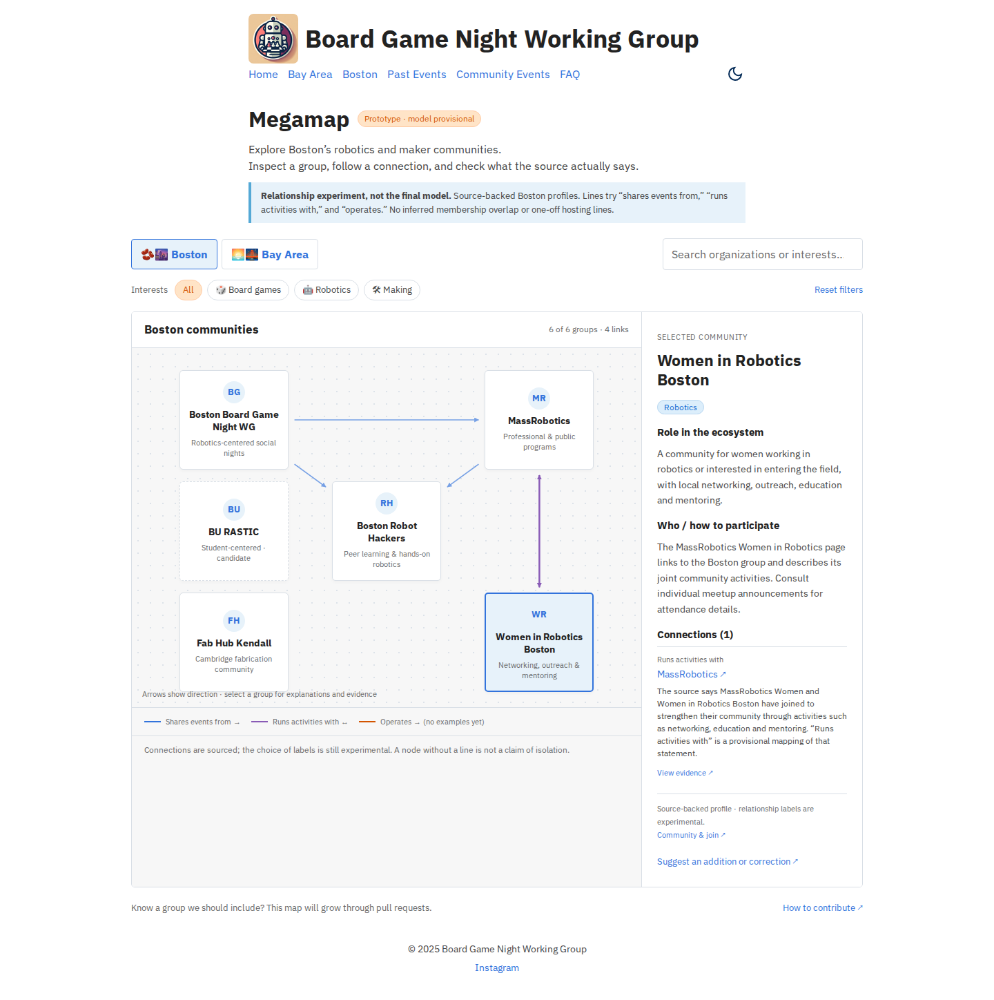
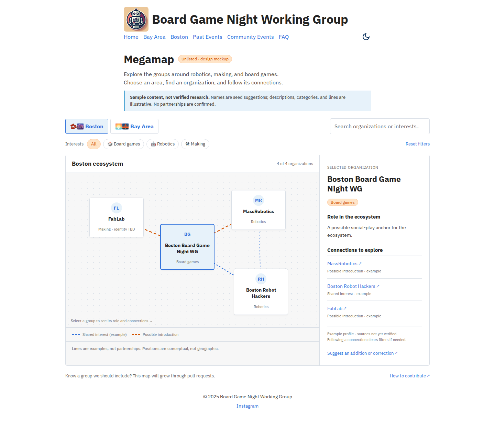
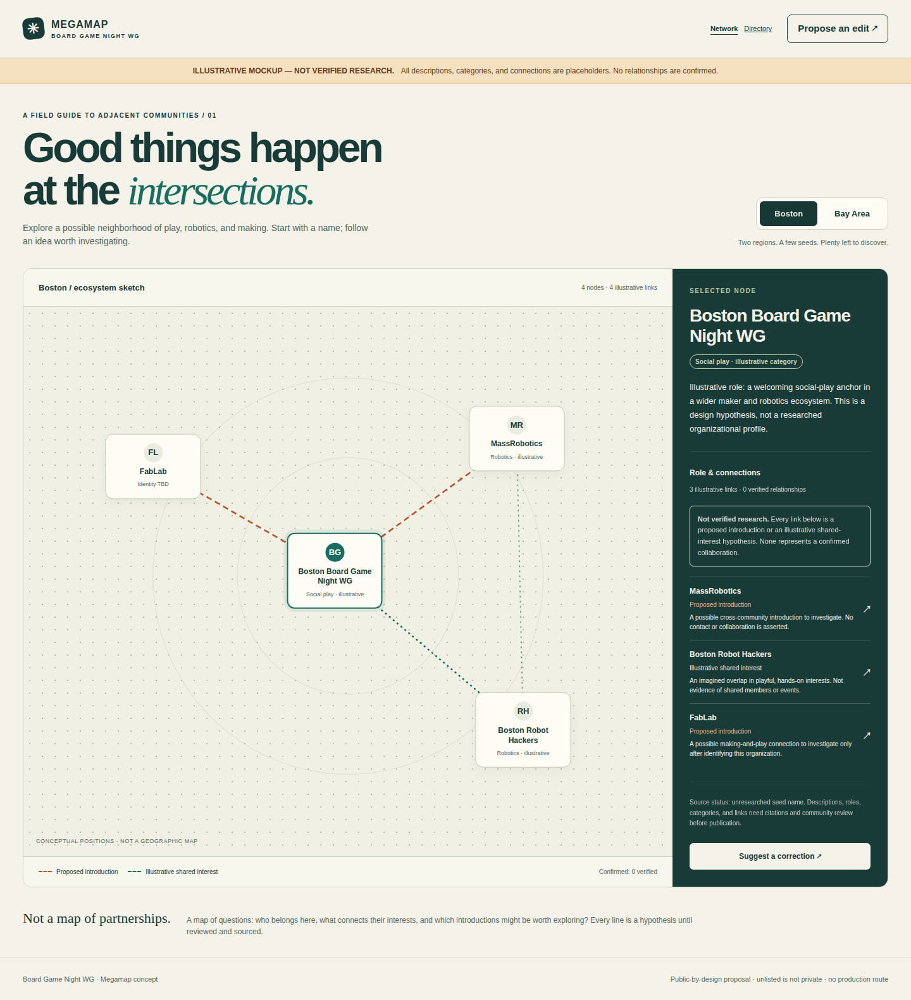
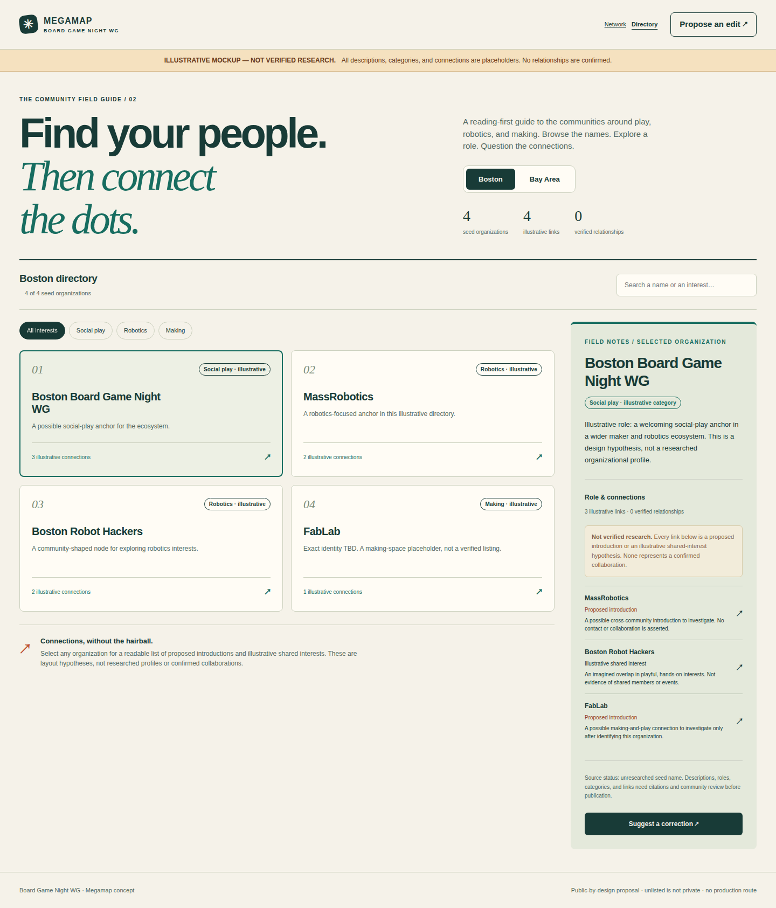

# Megamap: design exploration

Tracking epic: https://github.com/boardgamenightwg/boardgamenightwg.github.io/issues/96

## Current experiment: relationships and expanded Boston nodes

[Open the relationship prototype](relationship-prototype/index.html) · [Scope, sources and open questions](relationship-prototype/README.md)

Griz accepted **shares events from / runs activities with / operates for the prototype only**, explicitly not as a settled model. The current experiment adds Women in Robotics Boston, Fab Hub Kendall, and BU RASTIC as a candidate student-community inclusion. All connection explanations link to evidence; no speculative or one-off hosting edges are drawn.

[Dark desktop](previews/relationships-dark-1440.png) · [Mobile](previews/relationships-light-390.png)

## Approved visual design: site-themed hybrid

Griz selected **A's network + B's search/filters** and requested the existing website theme. The [site-themed hybrid](site-themed-hybrid/index.html) is the current mockup to review ([details and how to open](site-themed-hybrid/README.md)).

[Dark desktop](previews/site-themed-dark-1440.png) · [Light mobile](previews/site-themed-light-390.png) · [Dark mobile](previews/site-themed-dark-390.png)

These files are outside Zola's content/static directories and do not publish the route or change the live site. Open the hybrid HTML directly; Google Fonts supplies the same IBM Plex font as the live site, with a local fallback when offline.

## Original exploration (superseded by hybrid)

The original two directions are preserved for comparison.

- [Network-first](network-first/index.html): spatial relationships first, selected organization details alongside.
- [Directory-first](directory-first/index.html): browse organizations first, inspect role and relationships on selection.

## Try them

Download this folder and open either `index.html` in a browser. Each mockup contains its own styles, scripts, and sample data, with no external dependencies. Or serve the repository with `python3 -m http.server 8766` and open `http://localhost:8766/sketches/megamap/network-first/` (or `directory-first/`).

Try switching regions, selecting different organizations, the contribution explanation, and narrowing the browser to a phone width. Filters/search are exploratory UI, not locked product requirements.

## Desktop previews

### Network-first

### Directory-first

Mobile previews: [network](previews/network-first-390.png) · [directory](previews/directory-first-390.png).

## Content warning

Organization names come from Griz's initial seed list. Descriptions, categories, and links in these mockups are illustrative design fixtures, not researched claims or confirmed partnerships. The specific Boston FabLab is unresolved. The production dataset needs canonical sources and verified relationship semantics.

## Review questions

1. Should the first screen emphasize connections (network) or finding an organization (directory)?
2. Does the detail panel explain enough about an organization's role, participation, and resources?
3. Should shared interests be visible as lines at all, or should lines be reserved for documented relationships?

Griz selected a hybrid: network-first with directory search/filters. The current site-themed mockup awaits review; no production implementation or deployment is included.
